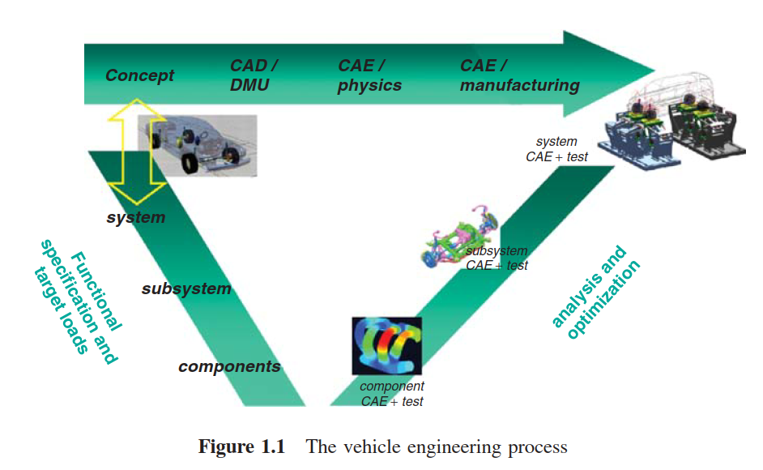

# 车辆工程耐久性载荷分析指南
## Chapter 1 引言

耐久性评估是汽车、航天、铁路运输以及风电工程等领域中的一个重要工程分支。耐久性的定义是进行相关讨论的基本元素，耐久性的常规定义如下：

> 耐久性是指在规定期限内，产品满足预设功能的能力  。

在本书中，耐久性被定义为车辆、系统或零部件在***给定的使用条件***和***维护条件***下，在***给定的期限***内满足***给定功能***的能力。

本书主要讨论了卡车工程种的耐久性载荷分析，但多数内容也适用于其他行业，尤其是在汽车领域相关的应用。本指南着重讨论的是引起疲劳损伤的载荷特性，而不是极端碰撞载荷或声载荷特性。疲劳损伤的机制主要以金属疲劳类损伤特性为主，2.1.5节对橡胶和复合材料的疲劳特性进行了一些讨论。

在汽车工程中，进行载荷分析的目的主要有：

* 对客户使用载荷进行评估和量化 ；
* 获得整车，子系统和零部件的设计载荷 ；
* 定义整车，子系统和零部件的验证载荷 。

本书分为三个部分，第一部分，概述，为各部分设置了讨论的范畴；第二部分，载荷分析的方法，讨论不同分析方法的原理及用途；第三部分， 从汽车设计过程的视角进行载荷分析，对上面的方法进行组织，讨论在不同的开发阶段使用那些分析方法。

### 汽车工程中的耐久性

车辆工程的**设计目标**是设计一款具有一定**物理属性**的的汽车，这些属性包括诸如耐久性能，NVH性能，操稳性和碰撞安全性等 。在车辆设计中，通过对各种设计变量进行分析、优化，并对各个物理属性进行数字化仿真和物理试验验证，典型的车辆开发流程如图1.1所示。车辆开发可以总结为以下几个阶段：

1. 概念定义 （定义车型的级别， 细分市场， 目标价格， 尺寸， 重量， 轴距， 等  ）；
2. 车型目标属性定义和对标（定义车型的性能， 耐久属性， 安全性能（碰撞）， 声学， 舒适性， 等）；
3. 设计目标分解 ：获得子系统和零部件的设计目标 （底盘悬架， 发动机， 变速箱， 车架， 车身）； 这些子系统和零部件的目标再与不同的物理属性相关（耐久， NVH， 操稳， 碰撞）；
4. 零部件、子系统和整车的设计；
5.  针对不同级别的零部件，子系统，不同的属性，通过物理试验和数字仿真对设计进行验证和优化；
6. 在整车级别进行验证。

对于卡车客户，耐久性是一个非常重要的物理属性。因此，在车辆开发过程中需要高度重视耐久性目标。图1.1所表示的车辆开发流程中，与耐久性相关的内容需要通过载荷分析实现。通常，汽车工业中所采用的载荷分析流程如图1.2所示。

金属的疲劳或其它与耐久性相关的现象都是一个随着时间性能逐步衰退的过程。当一定的力施加到一个结构上一次或几次不会造成明显的效果，但是，如果施加一百万次，有可能会造成结构失效。**因此，在耐久性工程中，载荷需要与疲劳现象、车辆动力学、用户使用的差异性共同研究。**

载荷可以是位移（线性或旋转），速度，加速度或力矩。它们可以代表路形，轮胎力，零部件之间的相对位移，框架的加速度或局部应变。我们所讨论的载荷信号是指在各种情况下施加在车上的一维或多维时间函数，例如，在客户使用时，在测试道路上，在测试台架上或虚拟仿真中。

图1.3表示了一个通过测量得到的运土车100分钟的工作载荷。我们可以观察到不同时间段，载荷均值，标准差的编号。载荷均值的变化是由车辆的载重量（空载，满载）变化引起的，而标准差的变化是由于不同的路况（平滑，粗糙）造成的。

### 可靠性，稳健性和稳健性

车辆设计的总体目标是制造出能够满足用户需求的可靠的、稳健的汽车， 通过阅读文献[22],[23],[172],[64]和[126] 了解可靠性和稳健性。为了达成这个目标，不仅要预测零部件的寿命，还要调查和考虑产品离散型的原因以及它们对寿命预测的影响。影响零部件寿命的因素主要有两个，一个是零部件经历的载荷，另一个是零部件的结构强度。统计方法提供了有力的工具来变数和量化载荷以及强度的离散特性，如图1.4所示。结构强度的离散性取决于材料的离散性和几何尺寸的误差。用户载荷的离散性取决于车辆的用途，驾驶员的习惯和市场。从零部件设计工程师的角度考虑，不同的车辆配置采用不同的零部件，比如支架，也是另外的一种离散来源。例如，对于卡车而言，同样的设计同时用于半拖车，两轴和三轴卡车。用于这些不同的卡车配置具有不同的动态特性，这也加剧了（载荷的）离散性。另外，对产品的验证通常在试验场路面上进行，这些路面代表了比普通用户更严苛的使用条件，尽管这些测试工况条件是可控的，但也存在一定的离散性，如图1.4所示。

传统的可靠性改进策略是利用测试和市场的反馈，理解产品的如何产生失效（失效模式），找到工程解决方案，减少或避免这些失效模式的影响。 目前，在设计早期阶段会根据过往经验对产品的可靠性进行预测并找出薄弱环节。由于需要测试或用户的反馈，传统的策略只适用于产品开发的后期阶段，大多数设计已经冻结，更改需要高昂的成本，具有很大的局限性。基于此种考虑，我们建议在设计早期进行载荷分析，而不是在试验验证阶段。本文中，理解载荷的分散性是工程知识的重要部分。

在工业领域，故障模式与影响分析（FMEA）的方法常用于进行可靠性评估。通过FEMA的研究发现，在大多数情况下，失效是由不必要的分散性造成的。因此，一种能够考虑失效原因的定量测量的方法，离散模式与影响分析（VMEA）产生了，参阅文献[127].[125], [54]. 离散模式与影响分析分为三个级别：基础级， 增强级和概率级。基础级VMEA适用于对离散性仅有模糊认识的情况下，离散性的敏感性和大小通过工程师进行判断，并设定1-10的量级。对离散性的来源具有更准确的判断时，可以采用增强型VMEA工具。在设计后期阶段，可以获取与强度和载荷有关的详细信息时可以使用概率型VMEA，这些信息包括详细的材料数据，计算局部应力所使用的有限元模型和物理试验结果等。不同的不确定度来源可以用标准偏差来衡量。7.6节中描述的载荷-强度模型是概率型VMEA模型在解决疲劳耐久问题中的一种应用。

### 卡车的载荷描述

本小节将对卡车载荷的典型影响因素进行描述，并讨论这些因素对卡车载荷的影响。卡车的载荷主要受车辆用途影响，用途决定了卡车的使用地点和使用方式。影响载荷的主要因素包括：

* **车辆的利用率**。车辆的利用率对卡车的寿命尤其重要，例如，车辆的年运输任务数量和年使用率；
* **车辆的使用环境**。例如车辆使用的路况和环境条件；
* **车辆的底盘特性**。例如，从卡车轮胎和悬架传递到车身上的局部载荷；
* **驾驶员的驾驶习惯**。例如，驾驶员习惯的车速变化，制动和转弯方式；
* **法规要求**。例如，在不同地域或国家的最高限速和准载质量。

通过车辆的使用率，工作环境，动态特性等因素可以准确的描述卡车的使用载荷。文献[87]给出了一种描述方式。为了简单明了的描述卡着载荷的这些影响因素，可以对路面进行分类，或通过几个关键的参数对路面特征进行描述。文献[30]，[33],[175,176]描述了一种垂向载荷的描述方法，文献[132]则描述了一种横向载荷的描述方法。

理想的载荷描述方式是将与车辆无关的载荷环境和与车辆相关的载荷影响因素分别进行描述。然后将特定车辆的动力学特性和使用情况与载荷环境相结合，一遍描述特定客户群体或特定车辆的载荷分布。如图1.5所示，此处车辆的使用情况包含的车辆的利用率和司机的驾驶习惯，这两个因素均与特定车辆相关。载荷环境包含了工作环境和法规等与车辆无关的要素。

车辆的利用率可以通过以下几个参数进行归类和描述：

* 运输周期（长途运输 — 短途物流分发— 建筑）；
* 运输任务（木材 — 废物 — 拖车 — 物流分发 — 等）；
* 年利用率
* 载重量或毛重

车辆的工作环境通过一系列的因素进行描述

* 路面质量（平滑 — 粗糙 — 越野）；
* 地势 （平坦 — 丘陵 — 山区）；
* 转弯密度（少 — 中等 — 多）；
* 海拔 （海平面 — 高海拔）；
* 气候（温度，湿度，沙尘，等）。

司机的驾驶习惯也会导致载荷的离散。离散的根源是驾驶方式的影响，比如加速和制动习惯等。特定的驾驶员可以通过其载荷强度的分布来描述。

载荷还可以按照其来源分为**外部载荷**（如，来自于道路激励）和**内部载荷**（如，来自于发动机和传动系统）。

### 为什么载荷分析很重要？

车辆耐久性不好不仅会使客户不满意，还会导致生产厂家遭受巨大的损失。产品失效会导致厂家对产品进行召回，质保，也会造成不良预期，减少企业利润。换句话说，车辆优良的耐久性能够保证产品的质量，公司的利润和顾客的满意度，参考文献[22]。为了进行准确的耐久性评估，需要考虑各种影响因素，目前，对多数影响因素的认识还不全面。图1.6为疲劳设计所需要考虑因素的简图。

目前，通过数字模型计算机械系统的应力和应变已经具有相当高的精度，但是，仿真计算周边有大量的不确定性。在输入端，载荷是通过简化使用载荷来估算输入载荷；材料强度由经验特性给出；几何形状由技术规格书给出。由于缺乏必要的信息，样件的划痕，杂质和气孔等非连续缺陷都被忽略了。在输出端，使用疲劳经验模型（S-N曲线，Miner准则， Pair准则）。这些模型存在一些模型误差，参数也是通过以前有限的疲劳试验得出的经验参数。因此，为了合理的评估疲劳评价的结果，必须要考虑载荷、材料和几何形状的不确定性。除此之外，也应注意到数模中也可能存在较大的模型误差，尤其是非线性模型，如多体动力学仿真中的轮胎模型，和有限元仿真中的焊点模型等。此外，载荷分析不仅在分析载荷输入时很重要，而且对于数值模拟过程，测量评估和物理验证测试也很重要。

本书主要关注在设计过程中如何对工作载荷进行评估和应用。但是，为了正确理解和处理载荷信息，需要了解其它环节的基本原理和信息。此外，本书第7章中介绍了如何使用载荷- 强度模型处理整体不确定度问题的方法。

### 本书的结构

本书分成三个部分：

***PART I 概述***

第一部分除了引言之外，第二章介绍了疲劳评估的一些基本概念，以及如何将这些概念应用于不同类型的载荷，指出系统或零部件与所使用分析方法之间的关系。最后，需要强调的是，疲劳预测收到众多不确定因素的影响，需要采用合理的方式对这些不确定因素进行处理和量化。

***PART II 载荷分析方法***

第二部分介绍了各种载荷分析方法。 除了介绍方法的基本原理之外，还描述它们的假设前提，相关性，优点，缺点和适用性。

***第三章 载荷分析基础***

 第三章介绍了在和分析的背景知识。3.1节介绍基于信号幅值的分析方法，这种方法主要集中于疲劳机理，以雨流循环计数，分级计数等循环计数方式进行计算，忽略了信号的变化速率。3.2节介绍了基于频域的分析方法，主要是基于功率谱密度（PSD）的载荷分析方法。3.3节多输入载荷的分析方法。

***第四章 载荷编辑和时间信号生成***

在需要情况下，都需要对载荷信号进行编辑。4.1节讨论了载荷信号的哪些属性与耐久性能相关，以及如何定义载荷等效的标准。很多时候，测量的信号中存在各种扰动，如偏置，漂移和毛刺等，使测量信号与实际存在一定的差异。4.2节讨论了载荷信号的检查和校正方法。4.3节讨论了基于信号幅值的编辑方法，介绍了迟滞滤波器等内容；基于频域的编辑方法如高通和低通滤波器等也有介绍。4.4节以雨流域为对象，讨论了雨流矩阵的缩放、累加和外推等方法。4.5节讨论了从压缩后的载荷表达方式中重新生成载荷时间信号的方法。

***第五章 机械系统的响应***

在进行载荷分析时，必须考虑载荷作用的机械结构。 5.2节和5.3节分别回顾了多体动力学仿真和有限元模型仿真计算在耐久性分析中的应用。利用多体动力学仿真，可以分析“从系统载荷到部件载荷”，利用有限元模型计算可以“从部件外部载荷获得局部应力-应变信号”。5.4节中讨论了不变系统的载荷问题，即在对原型车进行采集前，获得真实载荷的相关方法。

***第六章 随机载荷模型***

由于用户载荷以不可预测的方式变化。第六章使用随机过程对用户载荷进行建模。利用统计学模型，结合range-pair计数和分级谱，从损伤角度对载荷信号在耐久性方面进行讨论。随机载荷主要有两种建模方法，分别是：高斯分布载荷和马科夫载荷。高斯分布载荷主要根据频率分布进行建模，马科夫载荷根据载荷信号的转折点进行建模，进行建模的主要目的是进行随机载荷的损伤计算，同时处理损伤的不确定性。

***第七章 载荷的离散型和可靠性***

零部件的可靠性主要取决于其自身的强度和经历的载荷。本章对载荷和强度的离散型来源进行了讨论，回顾了不同的可靠性分析方法。本书建议采用一种二阶矩的可靠性分析方法，疲劳分析使用的载荷-强度模型和相应的可靠性安全系数，即可靠性指数（reliability index）在7.6节中进行讨论。在第7.6.9节中，将统计模型确定的安全系数与基于工程判断的安全系数相结合，提出了统计建模与工程经验之间的折衷方案。

***PART III 车辆设计中的载荷分析***

***第八章 用户载荷评估***

***第九章 设计载荷规范提取***

***第十章 系统和零部件验证***

## Chapter 2 耐久性载荷

本章将讨论疲劳损伤和载荷分析的基本工程方法，以及载荷的哪些属性与耐久性设计相关。本章主要包括以下内容：

* 用于分析复杂的载荷的Wohler模型和Palmgren-Miner模型；
* 进行疲劳分析的典型方法是将疲劳视为载荷循环引起的结果，因此讨论了不同的载荷循环计数方法；
* 根据系统和零部件不同的使用和安全要求，采用不同的设计策略；
* 回顾不同类型的机械系统所采用的不同的载荷分析方法；
* 最后，在设计的各个阶段都强调了由于载荷的离散型，以及对载荷的认识不足对疲劳预测的影响。

### 疲劳和载荷分析

本小节将简要的介绍高周疲劳（HCF: $10^4$或更多次循环载荷造成的疲劳失效）和载荷分析的基本概念。相关概念在第3章和附录A中将进行详细的阐述。

#### 定幅值载荷

定幅值载荷是最简单的载荷形式，如图2.1a所示。常见的高周疲劳损伤模型为S-N模型，也成为Wohler模型：

$$
N = 
    \begin{cases}
    \alpha S^{-\beta}, & S>S_f \\
    \infty, & S \leq S_f
    \end{cases}
    \tag{2.1}
$$

其中，$\it N$为发生疲劳时的载荷循环次数，$\it S$为载荷的应力幅值。材料参数：$\it \alpha$，为材料的疲劳强度；$\it \beta$，为疲劳指数；$\it S_f$，为疲劳极限。

#### 多级载荷

多级载荷是由多个不同幅值的定幅载荷首尾相连组合而成的载荷形式，如图2.1b所示。根据Palmgren-Miner[183,161]准则，每个幅值为$\it S_i$的载荷循环，造成了总寿命$\it 1/N_i$的损伤。
$$
D = \sum_i \frac {n_i} {N_i}
\tag {2.2}
$$

其中，$\it n_i$为$\it S_i$幅值载荷循环的次数，当累计的疲劳损伤$\it D$超过1时，产品发生失效。

#### 变幅值载荷和雨流循环

在实际使用中，车辆多数经历的都是变幅值随机载荷，很少定幅载荷和多级载荷。图2.1c和图2.1d为两种变幅值载荷。第一类成为窄带变幅值载荷，第二类成为宽带变幅值载荷。图1.3为采集到的卡车实际使用载荷。

对变幅值载荷的一种处理方法是利用循环计数方法将载荷分解为不同幅值的载荷循环，然后利用疲劳损伤累计方法（公式2.2）计算总损伤。载荷循环根据某种循环计数方法，由最不最大值和局部最小值组合而成，有多种形式的循环计数方法，参看文献[58]。

雨流循环计数法是目前业界公认的，接受程度最高的循环计数方法，目前有多个版本的算法，3.1.3节将对四点算法进行详细的解释。图2.2将根据Rychlik[198]对雨流循环的定义对雨流计数方法进行解释，这将对理解雨流循环的数学和统计特性有所帮助。

文献中有许多关于疲劳累计的方法理论，参看文献[92]，目前最流行的是线性疲劳累加原则Miner准则。Miner准则与雨流循环计数的组合是目前业界主流的工程方法。雨流循环法的有效性已由例如Dowling [76]和Jono [129]研究。 Dowling的确认实验的结论是：

> 通过雨流计数方法将所有闭合磁滞回线作为周期进行计数，可以准确预测寿命。 使用range-pair或雨流方法以外的任何循环计数方法都可能导致预测疲劳寿命与实际疲劳寿命之间的不一致和明显差异。

***Range-Pair***方法能够提取出与雨流计数方法同样的循环。另外，Jono[129]通过试验证明：Palmgren-Miner规则能够很好的适用于塑性应变的雨流循环引起的疲劳损坏。

#### 雨流矩阵，分级穿越和载荷谱

耐久性相关的载荷分析的主要与疲劳损伤机理相关。 本小节我们将将要介绍雨流矩阵，载荷谱、穿级计数和雨流滤波器的概念，并使用从两列同型号列车上采集到的载荷信号（图2.3），演示进行载荷分析的基本程序，这些内容在第3章将会展开进行详细描述。

进行信号处理的第一步是提取载荷信号的峰谷值，也称为转折点（TP: *Turning Points*）。在疲劳测试中，通常需要再保证等效损伤的前提下进行加速测试，减少测试时间。载荷信号中源自测量噪声或其它因素的小幅值信号对损伤的贡献可以忽略不记，所以通常还要从峰谷值信号中消除这些小幅值周期信号。 本例中，信号的采样频率为200 Hz，共有7, 500, 000个采样点，通过峰谷值提取可以缩减为大约500, 000个载荷循环。通过雨流滤波器，移除小于设定阈值的小幅值循环，可以进一步压缩载荷信号。设置雨流滤波器的阈值为*4 Mpa*，可以将载荷信号压缩到25, 000个点，在保持*99.8 %*损伤比例的条件下，实现20倍的疲劳加速（基于Miner准则，损伤指数$\beta = 4$）。

第二步，从雨流滤波器处理完的载荷信号中提取雨流循环序列，获取雨流矩阵，如图2.4和图2.5所示。这两个图以不同的形式表示了同一个雨流循环序列。图2.4采用了***min-max***形式，***x*** 轴表示雨流循环的最小值，***y*** 轴表示雨流循环的最大值，颜色表示雨流循环发生的频次，这种形式表示的雨流循环利于后期对雨流矩阵的统计和数学分析，例如，提取雨流矩阵或生成载荷时间信号，详见4.4节和4.5节。 由于金属疲劳仅与载荷的幅值相关，在疲劳分析中，雨流矩阵多表达为***amplitude-mean***或***range-mean***方式，***x*** 轴表示循环的均值，***y*** 轴表示雨流循环的幅值或范围，如图2.5所示，这种表示方式跟容易和载荷信号的疲劳特性相关联。虽然两种表示形式的结果有所不同，但实质上表达的均为同一个载荷循环序列。

从雨流矩阵对比中，我们能发现这两个载荷信号的一些差异。与第一个信号相比，第二个载荷信号具有更高的平均值，以及由于均值变化导致雨流循环分布区域更宽。由于应变片对温度敏感，第二个载荷信号应变片输出的波动是由采集点附件的温度波动产生，而非结构上的应力产生的。因此，平均应力的波动为虚假信号，需要采用去除动态均值的方法对信号进行处理。4.2节将对数据的检查和校正方法进行详细的简介。

雨流矩阵是一个三维矩阵，无法将两个矩阵进行叠加比较，因此，将雨流矩阵简化为二维的穿级计数谱或雨流幅值分布图，以便于对结果进行比较和理解。穿级计数谱既可以直接从载荷信号中计算，也可以从雨流矩阵中提取。图2.6a为两个载荷信号的分级计数谱，通过观察，二者的分级计数谱存在着较大不同，首先，第二个载荷信号有较高的均值；其次，两个载荷的尾部特征有明显差异。

另一种常用的二维分布为载荷谱。在多数资料中，载荷谱定义为信号雨流循环幅值的分布，通常用雨流循环幅值大于给定幅值的周期累计数来表示，是振幅的函数。载荷谱可以从雨流矩阵中获得，也称之为***range-pair***计数法，详见3.1.4节。对于两个测量信号的载荷谱，小幅值部分存在一定的差别，大幅值部分具有类似的特征，如图2.6b所示。

载荷谱也可以以直方图的形式进行表示，如图2.7a所示。按照线性比例绘制的雨流直方图，无法观察到那些损伤贡献高的大幅值循环，因此，根据幅值循环对应的损伤贡献绘制基于损伤的雨流直方图。在本例中，最大的雨流循环贡献了总损伤的2%（损伤指数 $\beta = 4$）。

#### 其它类型的疲劳

目前，很多对许多领域中的疲劳损伤机理和载荷分析认知尚不充分，例如，非金属材料（如橡胶，陶瓷，复合材料，塑料，胶水粘接等）的疲劳失效，难以对所产生的物理现象进行建模。除此之外，还存在其它疲劳现象，如高温疲劳和环境对疲劳强度的影响（温度，腐蚀和灰尘），本书不对这些问题进行专门介绍，但本书中的多数方法可适用于这些问题的分析。本小节将将要回顾这些特殊的疲劳问题，指出分析这类问题存在的困难和注意事项。

##### 低周疲劳

本书主要集中于高周疲劳的研究，但是书中所使用的多数方法和结论，例如，雨流循环计数，在和编辑方法，机械系统的响应，随机载荷模型和可靠性模型等，也适用于低周疲劳的分析。

##### 非金属疲劳

橡胶类材料不仅对载荷的幅值敏感，对载荷频率也敏感，提高加载频率会使材料发热，影响材料的疲劳特性。在对橡胶类零部件进行加速试验或建模时，可以通过降低加载频率或增加零部件的散热条件，保持橡胶部件的合理温度，使橡胶的材料特性与工作环境类似。除此之外，橡胶也对环境条件敏感，存在老化导致的性能退化。在工程上，雨流循环计数和Miner准则也适用于橡胶零件的变幅值载荷。对于橡胶材质疲劳现象的研究参看文献[153]，影响因素和处理方法参看文献[154]。对于陶瓷、塑料和复合材料等脆性材料，断裂强度是其最重要的属性，而不适用于损伤累积原理。对于胶接和塑料等材料，材料的老化效应会导致的强度的明显下降。

##### 高温疲劳

尽管只有少数汽车零部件会经历热机械载荷循环，但热载荷会产生明显的低周疲劳现象，因此，对发动机相关的组件，例如气缸盖，排气歧管和曲轴箱等，必须考虑热机械负荷。 在这种情况下，低循环疲劳问题与发动机的启停循环相关，与燃烧循环无关，建模时应重点关注缓慢的温度变化。 与室温疲劳相比，在对载荷进行建模并进行寿命评估时，需要考虑多个复杂因素，例如材料的老化，蠕变，循环粘塑性行为，应力应变行为以及适当的疲劳准则。 文献[55]研究了汽车行业的热疲劳评估，文献[233]在对铝缸盖进行疲劳评估时，对铸铁排气歧管进行热疲劳评估。低周疲劳的基本模型是反映了塑性应变与疲劳寿命关系的***Coffin-Manson***模型[231]。

##### 环境效应

许多工程结构除了经受某种形式的交变应力外，还受到有害环境的影响。由于环境因素（如，腐蚀和沙尘等）的影响产生的疲劳难以建模，但考虑零部件的使用环境非常重要。腐蚀疲劳是材料机械特性在腐蚀和周期载荷共同作用下退化导致的，文献[197]对腐蚀疲劳机理进行了详细的研究。环境腐蚀对疲劳分析最重要的影响是导致部件疲劳强度的降低和疲劳极限的小时。因此，在存在腐蚀效应的疲劳分析中，需要考虑低于疲劳极限的小循环载荷。研究腐蚀问题的主要模型是***Arrhenius***方程，它模拟了性能随时间退化的过程。文献[131]讨论了其它环境因素的影响，如温湿度和灰尘等。

### 疲劳设计中与载荷分析

在进行零部件设计时，首先要弄清楚该部件的重要性，以及该零部件失效造成的后果。根据零部件的重要性和后果选择对应的设计原则和载荷分析方法，汽车零部件的设计原则重要分为以下几类：

* 疲劳寿命 —— 累积损伤

  — 零部件设计为有限寿命，结构相关部件通常采用此设计和分析原则；

* 疲劳极限 —— 最大载荷

  — 零部件设计为无限寿命，发动机相关部件采用此设计和分析原则；

* 突发失效 —— 最大载荷

  — 根据偶然事件进行设计，典型应用于结构相关部件；

* 安全相关零部件 —— 零失效

  — 适用于高可靠性设计需求，典型应用于转向系统相关部件。

#### 疲劳寿命： 累积损伤

基于疲劳寿命和累计损伤设的设计原则主要适用于结构相关零部件，如车架， 驾驶室和车轴等。在进行疲劳设计时，使用有限疲劳寿命设计原则，例如，使用Wohler曲线和Miner损伤累计原理进行寿命预测。使用此类设计原则时，主要关注变幅载荷的幅值和循环次数，以及进行疲劳测试加速时移除（过滤）的限值。

在多数情况下，普遍认为疲劳现象与载荷的速率（频率）无关，在进行疲劳分析时，最重要的属性时局部载荷的极值和组合次序。因此，载荷可以被看做由一系列局部最大和最小值组成的循环序列。***但是，在外部载荷到局部应变的转换过程中，可能与外部载荷的频率高度相关，这部分内容将在有关“机械系统响应”的章节进行讨论。***

#### 疲劳极限：最大载荷

基于疲劳极限的设计原则主要适用于发动机和传动系统的相关零部件。这些零件在短时间内（与设计寿命相比）经历了几百万个载荷循环，并且不允许出现任何裂纹，因此需要根据疲劳极限（Fatigue limit）原则进行设计，主要关注载荷的最大值。

对此类零部件进行载荷分析时，核心问题时如何确定，并理解最大载荷。对于发动机和变速器部件，载荷主要是来自发动机内部，当发动机输出最大扭矩时，可以理解为输出载荷是最大载荷的某个高分位数。

#### 突然失效：最大载荷

最大载荷还适用于针对误操作，（小概率）特殊事件和产生的过载导致的零部件过载失效设计。 在这种情况下，车辆不应突然可以产生塑性变形，并可能受到严重损坏，但不能够突然断裂失控。 当考虑过载时，最大载荷可能是在寿命周期内只出现一次或几次。 最大载荷使用统计极值理论，从载荷测量值中估计得到。

#### 安全相关件

一类特殊的零部件被称为安全相关零部件，如转向节等，这类零部件原则上不允许产生失效。实际情况下，可以将零失效理解为具有非常低的失效风险。在考虑安全相关零部件时，需要采用对应的载荷分析方法，如7.6小节描述的载荷-强度方法。

### 系统响应与载荷分析

每种载荷分析方法都有适用的范围，因此，在针对特定任务进行载荷分析时，需要选择对应的分析方法。本小节将根据完整的工程开发流程，根据各个开发阶段的需求，指出所使用的载荷分析方法。

从图1.2所描述的车辆开发流程看，特定零部件的载荷一方面取决于载荷目标设定，另一方面却决于车辆所受外部激励的传递。载荷目标设定主要根据预期客户进行设定，与车辆型号无关。车辆所受外部激励的传递取决于路面状况，轮胎、悬架和轴承的传递特性。本小节将根据车辆所受外部激励的传递路径进行讨论。使用这种方法，我们可以讨论不同级别的负载，即

* 系统级（道路状况， 车轮力，等）；
* 子系统级（车架与悬架之间悬置处的力或加速度）；
* 零部件级（转向节的受力）
* 局部级（零部件特定位置的局部应力或应变）

图2.8描述了载荷的传递路径。载荷信号可以通过以下几种形式进行表示：

* 时间域（时间信号）；
* 频率域（PSD，等）；
* 幅值域（雨流直方图，分级计数直方图或range-pair直方图）

时间域信号包含载荷完整的信息，而频率域和幅值域信号只包含了载荷某一方面的信息，适用于某一种分析方法。

如前文所述，在局部级的载荷分析中，许多疲劳现象可以认为与载荷频率无关，即只需要考虑应变信号的局部极值，而不需要考虑中间过程。在这种情况下，幅值域的描述就足够了。

零部件级的载荷分析需要考虑零部件自身的特性，刚性零部件（如，转向节）与非刚性零部件（驾驶室）的载荷分析有所不同。系统的机械特性分类如图2.9所示。

根据零部件的类别，关注的载荷特性也有所不同。如图2.10所示，除了线性刚度零部件外，仅频域和幅度域信号均不能满足对零部件的载荷描述，需要使用时域信号进行描述。尽管如此，通过对这些方法的组合使用，深入了解载荷负载并对载荷对部件的各种影响进行分析。 这种思路也适用于子系统和系统级的载荷分析。 因此，载荷的模型和分析方法在很大程度上取决于载荷所作用的机械系统。

### 载荷的离散性

由于制造过程的不完美，每一个零部件在宏观层面（如部件的几何形状）和微观层面（如结构关键点的晶粒结构）都有所不同。因此， 每一辆车都是独一无二的，即没有任何两辆车具有相同的机械和材料特性。这种离散型可以用强度分布表示，如图1.4所示。

每一辆车的用途也时独一无二的。卡车的载荷取决于卡车类型（如，建筑或物流分发），所使用的市场，所有者（如，小公司或大公司），驾驶员类型（拥有人或雇员），等因素。这些对使用载荷离散性的影响因素均在第1.3节进行了讨论，用户载荷使用用户载荷分布进行描述，如图1.4所示。

#### 不同类型的离散性

为了描述零部件的可靠性，需要同时评估产品强度的离散性和用户载荷的离散性。本书主要讲解载荷的分析和处理，主要关注于载荷的离散性。

根据所研究的对象不同，离散型也有所不同。首先，载荷时间信号是一个随时间变化的物理量，其次，每次重复测量获得的时间信号也存在差异。例如，两次采集时间信号所转化成的雨流矩阵不完全相等，如图2.3所示。对载荷信号的严苛程度进行量化评估是有意义的，因为它通常与疲劳寿命相关。两次测量所获得载荷信号的严苛程度也存在一定的差异。

当考虑载荷的离散性时，可以在单一用户载荷的离散性，和用户群体载荷分布的离散性两个维度进行研究。对单一用户而言，对同一事件的两次测量不会获得相同的载荷时间信号，因为即使在条件完全相同的情况下，仍然存在随机误差。对用户群体（例如，某一市场的客户，或某一用途的客户）而言，可以利用统计学方法描述载荷的离散性，斌通过均值和标准差提取其特征。

进行车辆设计时，有一个重要的问题是：我们的目标客户群体是哪些？目标群体可以是某一细分市场，也可以是来自某一用途类型的客户，还可以是从来自特定群体的司机，或某一载荷特性的司机，例如，通常选择去95%分位数的司机代表试验场或台架的载荷。

当构建离散性模型时，需要根据离散类型进行分类，详细参看文献[74]和[159]。在讨论离散性时，需要区分以下三类不确定性：

* **离散分布或物理上的不确定性**。这类不确定性与固有的随机性相关，例如，不同驾驶员操作导致的载荷离散性。
* **统计学意义的不确定性**。这类不确定性与统计估计方法有关。例如，根据已有的少量数据，估计95%分位数客户的载荷。（由于数据较少，估计得到的统计学参数与实际存在偏差）
* **模型不确定性**。模型不确定性与使用简化模型相关。例如，采用有限元模型，计算应力。

第一种不确定性也称为偶然不确定性，是指无法避免的，内在的不确定性。例如，客户群体中，疲劳寿命的离散性。后两种不确定性属于认知不确定性，可以通过获得附加数据，更详细的信息，更好的建模或精确的参数估计来减少。

#### 不同环境下的载荷

汽车设计中存在三种不同环境下获得的载荷，分别为：用户实际使用载荷，试验场载荷和台架载荷。这三种载荷具有不同类型和幅度的离散性。

##### 用户载荷

为了设计一款符合用户实际使用需求的车辆，需要根据1.3节中描述的那些方面，对用户载荷进行评估，既要评估其典型值，也要评估其离散性。因此，我们需要采用一些方式从客户那里获得这些信息。例如，对客户用途进行问卷调查，采集一些特定客户的使用载荷，通过车载数据采集系统获得大量用户的使用数据。这些方式都需要进行详细的计划，以获得有效数据。第8章将对这些问题进行讨论。

##### 试验场道路与驾驶员

通常情况下，需要将用户载荷转化为试验场测试程序。第9章将讨论如何进行转换。虽然试验场测试环境具有良好的可控性，载荷采集所使用的驾驶员也经过了良好的训练，但测得的载荷信号仍然存在明显的离散性。不仅多个驾驶员之间存在离散性，而且同一个驾驶员的多次采集之间也存在离散性。如图2.11所示。三个驾驶员驾驶同一台车，根据相同的指令，在同一条赛道上行驶5圈，每圈的载荷各不相同。在公共道路上进行的采集也存在类似的问题，第8.3.1节将对这种现象进行详细的探讨。

##### 台架试验

同样，在受控的疲劳寿命实验中，也存在不希望的载荷离散性。 例如，测试设备的控制系统不完美，测试样品的工装也不完美，这可能会引入不必要的应力分量。 请注意，施加载荷变化5％可能会导致寿命缩短30％以上。 此外，如果我们想将测试结果与设计规范联系起来，从客户负载分布到疲劳测试规范转换，测试样件的工装约束都存在误差。验证试验将在第10章进行详细讨论。

### 总结

本章讨论了可靠性和载荷的基本概念，为后面章节对载荷分析方法的讨论奠定了基础。如本节所述，某些情况下，车辆的动态特性至关重要的，而在某些情况下则不是关键。 同样，可用的载荷信息也会影响到分析方法，在考虑评估结果时，还需要考虑载荷的离散性。

